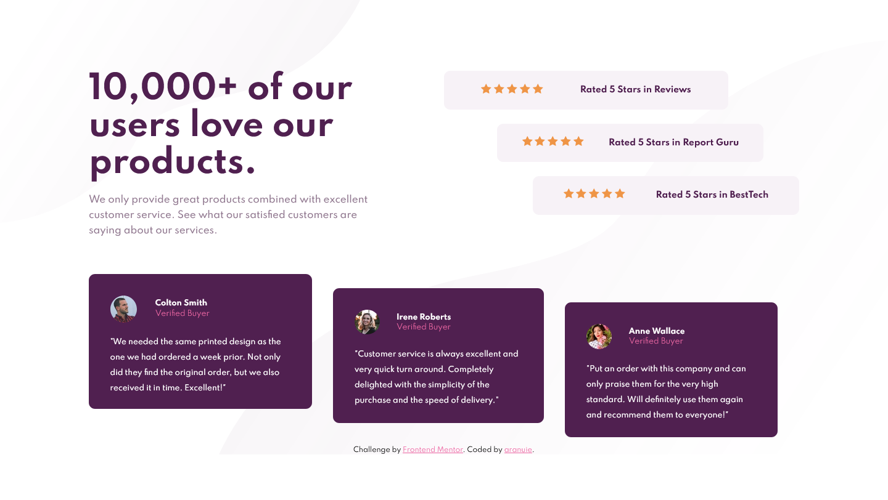

# Frontend Mentor - Social proof section solution

This is a solution to the [Social proof section challenge on Frontend Mentor](https://www.frontendmentor.io/challenges/social-proof-section-6e0qTv_bA). Frontend Mentor challenges help you improve your coding skills by building realistic projects. 

## Table of contents

- [Overview](#overview)
  - [The challenge](#the-challenge)
  - [Screenshot](#screenshot)
  - [Links](#links)
- [My process](#my-process)
  - [Built with](#built-with)
  - [Useful resources](#useful-resources)
- [Author](#author)

## Overview

### The challenge

Users should be able to:

- View the optimal layout for the section depending on their device's screen size

### Screenshot

### Links

- Solution URL: [My Solution](https://www.frontendmentor.io/solutions/social-proof-section-challenge-using-css-flexbox-m6DANxZbd)
- Live Site URL: [Live Site URL](https://aranuie.github.io/social-proof-section-master/)

## My process

### Built with

- Semantic HTML5 markup
- CSS custom properties
- Flexbox
- Mobile-first workflow

### Useful resources

- [W3C Markup Validation Service](https://validator.w3.org/)
- [W3C CSS Validation Service](https://jigsaw.w3.org/css-validator/)

Both of these validators helped me make sure my code was free of mistakes and up to date.

## Author

- Website - [aranuie.design](https://aranuie-design.fr/)
- Frontend Mentor - [@aranuie](https://www.frontendmentor.io/profile/aranuie)

